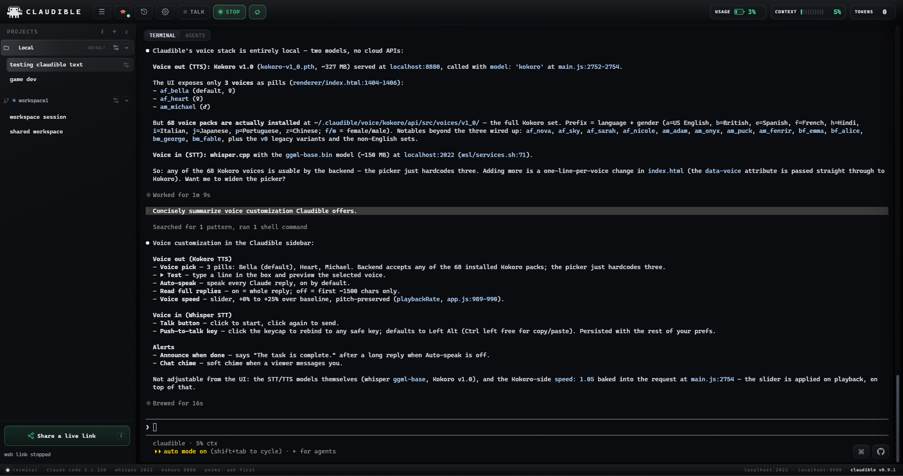
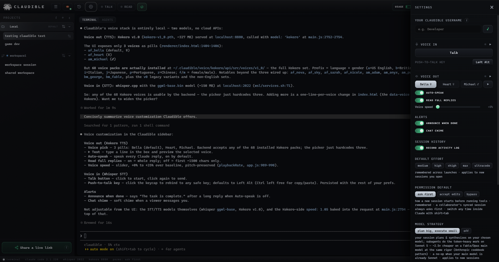
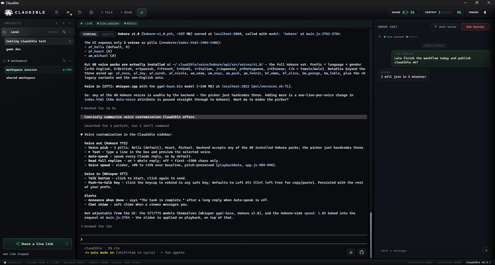
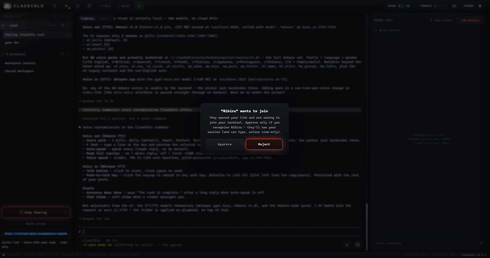
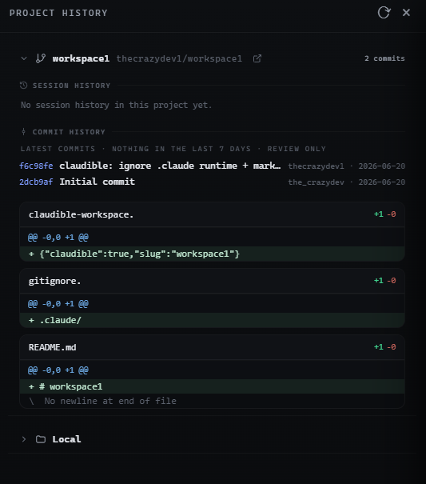
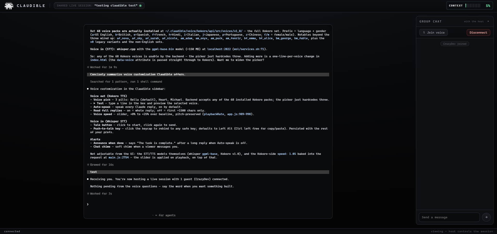
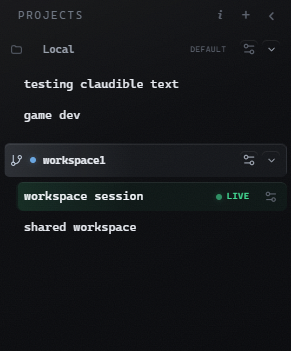

<p align="center">
  
</p>

<h1 align="center">Claudible</h1>

<p align="center"><b>Claude Code made Multiplayer with live telemetry and UI.</b><br>
<i>Share your live session with a link. Your team watches, talks, and co-drives: any browser, any device, even a phone.</i></p>

<p align="center">
  
  
  
  
  
</p>

<p align="center">
  
</p>

<p align="center"><sub>Your projects and sessions on the left, the real Claude Code terminal in the middle, live telemetry across the top.</sub></p>

---

Claude Code is one person, one terminal. Claudible makes it a team sport:

- 🤝 **Live multiplayer.** Invite anyone into your *running* session: they watch, chat, or take the keyboard and co-drive the same Claude.
- 🎙️ **Voice, 100% local.** Talk to Claude, hear it answer. Whisper + Kokoro run on your machine, not in a cloud.
- 📊 **Live telemetry.** Context, cost, and tokens at a glance, with a one-tap `/compact` before you run out of room.
- 🛰️ **Agents cockpit.** Watch subagents and workflow swarms work in real time: task, tools, token burn, which model runs each agent.
- 🕘 **Per-prompt history + revert.** Every prompt gets a git-backed snapshot. Roll the code back to any of the last 10, and undo the revert.
- 🔒 **Nothing hosted.** Invite links tunnel *out* from your machine, every guest waits in a lobby until you approve them by name, and the real Claude Code TUI stays untouched (xterm.js, full scrollback).

Claudible is in **public beta**: expect fast releases and the occasional rough edge; [issues](https://github.com/synthetiks/claudible/issues) are very welcome.

## A look inside

<table>
  <tr>
    <td width="50%" valign="top">
      
      <p><sub><b>One settings panel.</b> Voice in and out, alerts, default effort, permission mode, model strategy.</sub></p>
    </td>
    <td width="50%" valign="top">
      
      <p><sub><b>Go live.</b> Guests land beside your terminal and chat while Claude keeps working.</sub></p>
    </td>
  </tr>
  <tr>
    <td width="50%" valign="top">
      
      <p><sub><b>A lobby, not a free-for-all.</b> Every guest waits until you approve them by name.</sub></p>
    </td>
    <td width="50%" valign="middle" align="center">
      
      <p><sub><b>Live telemetry.</b> Usage, context and tokens, always in the title bar.</sub></p>
    </td>
  </tr>
  <tr>
    <td width="50%" valign="top" align="center">
      
      <p><sub><b>Session history.</b> Past sessions and recent commits, per project.</sub></p>
    </td>
    <td width="50%" valign="top">
      
      <p><sub><b>Any browser.</b> Guests open a link and they are in. Nothing to install.</sub></p>
    </td>
  </tr>
  <tr>
    <td colspan="2" valign="top" align="center">
      
      <p><sub><b>Projects and repos.</b> Local folders and GitHub repos in one sidebar.</sub></p>
    </td>
  </tr>
</table>

## Get started

### 🪟 Windows: download and run
1. Grab the latest **`Claudible-Setup-<version>-x64.exe`** from **[Releases](https://github.com/synthetiks/claudible/releases)**.
2. Run it. It's unsigned during beta, so SmartScreen shows *"Windows protected your PC"*: click **More info → Run anyway** once.
3. Launch Claudible from the Start menu. First run sets up local voice by itself (a few hundred MB of models; resumable if interrupted).

Already needs to be on the PC: **Claude Code for Windows** (run `claude` once in any terminal and sign in), **Node.js 22.12+** ([nodejs.org](https://nodejs.org)), and **Git for Windows** ([git-scm.com](https://git-scm.com/download/win)). Native-Windows voice is the newest path; if it snags, logs are at `%USERPROFILE%\.claudible\logs\` and the WSL build below is the proven one.

### 🛠️ Build from source
Maturity, honestly: **Windows + WSL2** is the battle-tested path, **Linux** is verified, **native Windows** and **macOS** are code-complete with runtime smoke tests in progress.

<details open><summary><b>🪟 Windows 11 + WSL2 · recommended</b></summary>

You need **WSL2** with a **signed-in Claude Code** inside it (`claude` on your PATH), plus **Node.js 22.12+** on Windows. **Run this in Windows PowerShell, not inside WSL** (Claudible is a Windows Electron app that embeds Claude Code running in WSL):
```powershell
$dir = (Read-Host "Install folder for Claudible (Enter for default) [$HOME\claudible]").Trim().Trim('"'); if (-not $dir) { $dir = "$HOME\claudible" }; if (!(Get-Command git -ErrorAction SilentlyContinue)) { winget install --id Git.Git -e --source winget --accept-source-agreements --accept-package-agreements; $env:Path = [Environment]::GetEnvironmentVariable('Path','Machine') + ';' + [Environment]::GetEnvironmentVariable('Path','User'); if (Test-Path "$env:ProgramFiles\Git\cmd\git.exe") { $env:Path = "$env:ProgramFiles\Git\cmd;$env:Path" } }; if (!(Get-Command git -ErrorAction SilentlyContinue)) { Write-Host "`n[!] Git for Windows is required and couldn't be auto-installed (no winget on this system?). Install it from https://git-scm.com/download/win, reopen PowerShell, then run this line again." -ForegroundColor Yellow } else { git clone https://github.com/synthetiks/claudible "$dir"; if ($LASTEXITCODE -ne 0) { Write-Host "`n[!] git clone failed -- see git's error above. Likely causes: no internet/proxy blocking github.com, or `"$dir`" already exists and isn't empty. Fix that, then run this line again." -ForegroundColor Yellow } elseif (Test-Path "$dir\install.ps1") { powershell -NoProfile -ExecutionPolicy Bypass -File "$dir\install.ps1" } else { Write-Host "`n[!] install.ps1 is missing after clone -- your antivirus most likely quarantined it (a false positive). To fix: allow/exclude the folder `"$dir`" in your antivirus, then run these two lines:`n    git -C `"$dir`" restore install.ps1`n    powershell -NoProfile -ExecutionPolicy Bypass -File `"$dir\install.ps1`"`nPer-antivirus steps are in `"$dir\SETUP.md`" (the Antivirus section)." -ForegroundColor Yellow } }
```
One line: asks where to install, auto-installs git via winget if missing, clones, installs everything, and launches. **First run only:** the voice build compiles whisper.cpp and downloads ~480 MB of models (10–20 min; rerunning the line resumes). Voice build deps inside WSL (`git cmake build-essential ffmpeg espeak-ng python3 curl` + [`uv`](https://docs.astral.sh/uv/)): `npm run setup` checks and prints the exact apt line. No `winget`? Install [Git for Windows](https://git-scm.com/download/win) manually, reopen PowerShell, rerun. Full troubleshooting: **[SETUP.md](SETUP.md)**.

<details><summary>Prefer to run the steps by hand?</summary>

```powershell
git clone https://github.com/synthetiks/claudible
cd claudible
npm install        # deps + node-pty's N-API prebuilt + the small JS patch (no compiler needed)
npm run setup      # builds the WSL voice services (installs their deps; ~480 MB models on first run)
npm start          # opens the cockpit
```
Optional Desktop shortcut: `powershell -NoProfile -ExecutionPolicy Bypass -File launch\make-shortcut.ps1`
</details>
</details>

<details><summary><b>🪟 Windows native (no WSL) · new</b></summary>

Needs Windows **Node 22.12+** and **Git for Windows** (`bash.exe`). Installs Claude Code for Windows if it's missing.
```powershell
git clone https://github.com/synthetiks/claudible
cd claudible
powershell -NoProfile -ExecutionPolicy Bypass -File .\install.ps1 -Native
```
Downloads the prebuilt `whisper-server.exe` + speech model and sets up Kokoro via [`uv`](https://docs.astral.sh/uv/) (no Visual Studio, Python, or cmake), then pins `CLAUDIBLE_RUNNER=win` (remove that user env var to fall back to WSL). Run it through `powershell -ExecutionPolicy Bypass -File` exactly as shown; Windows' default policy blocks `.\install.ps1` directly. Clone into your home or projects folder with a normal, non-admin PowerShell.
</details>

<details><summary><b>🐧 Linux · verified backend</b></summary>

Needs **Node 22.12+**, a C toolchain (`build-essential` + `python3`; `node-pty` compiles on install), and **Claude Code on your PATH** (`claude`, signed in).
```bash
git clone https://github.com/synthetiks/claudible
cd claudible
npm install            # builds node-pty for Linux (needs build-essential + python3)
bash setup/setup.sh    # whisper.cpp + Kokoro (~480 MB models on first run)  ·  NOT `npm run setup` (that's the Windows→WSL wrapper)
npm start              # auto-selects the native Linux backend (no WSL involved)
```
Packaged installers build with `npm run dist:linux` (AppImage + `.deb`).
</details>

<details><summary><b>🍎 macOS · new</b></summary>

Needs **Node 22.12+**, **Claude Code on your PATH**, **Xcode Command Line Tools** (`xcode-select --install`), and `brew install cmake ffmpeg espeak-ng`.
```bash
git clone https://github.com/synthetiks/claudible
cd claudible
npm install
bash setup/setup.sh    # detects Homebrew for the build deps  ·  NOT `npm run setup` (Windows→WSL only)
npm start
```
A signed `.dmg` is the planned release artifact (`npm run dist:mac`). Runtime smoke pending (needs a Mac).
</details>

## Live sharing, in 20 seconds
Click **Share**: Claudible starts a tiny server on your own machine and hands you a private link. With [`cloudflared`](https://github.com/cloudflare/cloudflared) installed it's a free `https://<random>.trycloudflare.com` tunnel that works across networks; without it, localhost/LAN only. Up to 8 guests open the link, wait in a lobby, and see nothing until you approve each by name. Per share you pick **read-only** (watch + chat) or **interactive** (type into the same session). Guests get a chat, a voice room, and a mobile-friendly viewer. The link is ephemeral: it dies the moment you stop sharing, and **New link** locks out anyone holding the old one. A guest who can't reach the link is almost always a network or VPN issue; a fresh link or a phone hotspot sorts it.

Two things worth knowing before you share:
- **Share live** in a synced project doesn't just mint a link; it also advertises it on the project's `claudible/sessions` branch so teammates see a **● LIVE** badge and can join without you pasting anything. Anyone with git access to that repo can read the link (they still wait in your lobby). Want exactly one invitee? Use plain **Share** and send the link yourself.
- Turning on **session sync** for a repo-backed project commits full transcripts to that private repo: prompts, code, tool output, anything Claude read, plus your name, `gh` login, git email and machine. Every collaborator with git access can read them. Disclosed in-app before you enable it, and off until you do.

## Security & privacy
- **Permissions are yours.** The embedded Claude Code prompts before running tools, exactly like the normal CLI; Settings can remember **Accept edits** or **Bypass permissions** for a one-click/voice flow. A session synced from a collaborator is **always sandboxed** (normal prompting, never auto-resumed), regardless of your setting.
- **Voice is local; Claude Code is not.** Whisper and Kokoro never leave your machine and Claudible sends no telemetry. The embedded Claude Code talks to Anthropic exactly as the normal CLI does.
- **Interactive guests type into your session**, which may run with skipped permissions. Grant it only to people you trust, prefer read-only otherwise, and rotate or stop the share when you're done.
- The voice services bind `0.0.0.0` so the Windows app can reach them over the WSL2 NIC; on WSL2's default NAT networking they aren't exposed to your LAN. Full threat model and disclosures: **[SECURITY.md](SECURITY.md)**.

## Platform support
Every OS-coupled call goes through one `Runner` seam (`runners/{wsl,posix,win}.js`); the script fleet is Python-free, so the only per-OS runtime is Node + a shell.

| Platform | Status |
|---|---|
| **Windows + WSL2** | Battle-tested; the recommended path |
| **Linux** | Native backend live-tested; AppImage + `.deb` build in CI |
| **Windows native (no WSL)** | Code-complete; runtime smoke in progress |
| **macOS** | Code-complete; needs a Mac for smoke + signing |

Deep dive: [docs/ARCHITECTURE.md](docs/ARCHITECTURE.md).

## Staying up to date
- **Clone installs update themselves.** An **Update & restart** chip appears when a newer commit lands; one click pulls, reinstalls deps if they changed, and relaunches (`install.ps1 -NoUpdate` opts out). Packaged `.exe` installs get a notice-only "newer release available" toast.
- In a live session, a peer on a different commit shows a **build-skew note** on their ● LIVE badge, so "did you restart onto the update?" answers itself.
- **Optional sub-second presence:** by default "went live" reaches collaborators in a few seconds over the shared git branch; a team that wants faster can self-host the tiny Cloudflare Worker in [`relay/`](relay/). Off unless configured. See [`relay/README.md`](relay/README.md).

<details><summary><b>Configuration (env vars)</b></summary>

| Env var | Default | Meaning |
|---|---|---|
| `CLAUDIBLE_WHISPER` | `http://localhost:2022` | STT endpoint (any OpenAI `/v1/audio/transcriptions`) |
| `CLAUDIBLE_KOKORO` | `http://localhost:8880` | TTS endpoint (any OpenAI `/v1/audio/speech`) |
| `CLAUDIBLE_VOICE` | `~/.claudible/voice` | where the local voice services are installed |
| `CLAUDIBLE_CLOUDFLARED` | _(auto-detect)_ | path to a `cloudflared` binary for cross-network co-work tunnels |
| `CLAUDIBLE_WHISPER_PORT` | `2022` | port `services.sh` binds Whisper on |
| `CLAUDIBLE_KOKORO_PORT` | `8880` | port `services.sh` binds Kokoro on |

Claudible speaks the OpenAI audio API, so any compatible STT/TTS works (LM Studio, your own server). If you change a port, set the matching URL too.
</details>

<details><summary><b>Uninstalling</b></summary>

**Windows:** uninstall from *Settings → Apps*. Left behind on purpose so a reinstall keeps your work: `~/.claudible/` (projects, settings, session history) and `~/.claudible/voice/` on the WSL/Linux side (models + build, several hundred MB); delete them by hand to reclaim the space. The Whisper (`:2022`) and Kokoro (`:8880`) helpers can keep running after quit: `pkill -f whisper-server; pkill -f kokoro` (or close the WSL session).

**Linux/macOS:** delete the cloned repo and `~/.claudible/`, then stop the voice services the same way.
</details>

## License
[MIT](LICENSE). Third-party components bundled in the installer are listed in [THIRD-PARTY-LICENSES.md](THIRD-PARTY-LICENSES.md).

---

*Built by thecrazydev1 and MKDevv05 with Claude, published under the synthetiks organization.*
